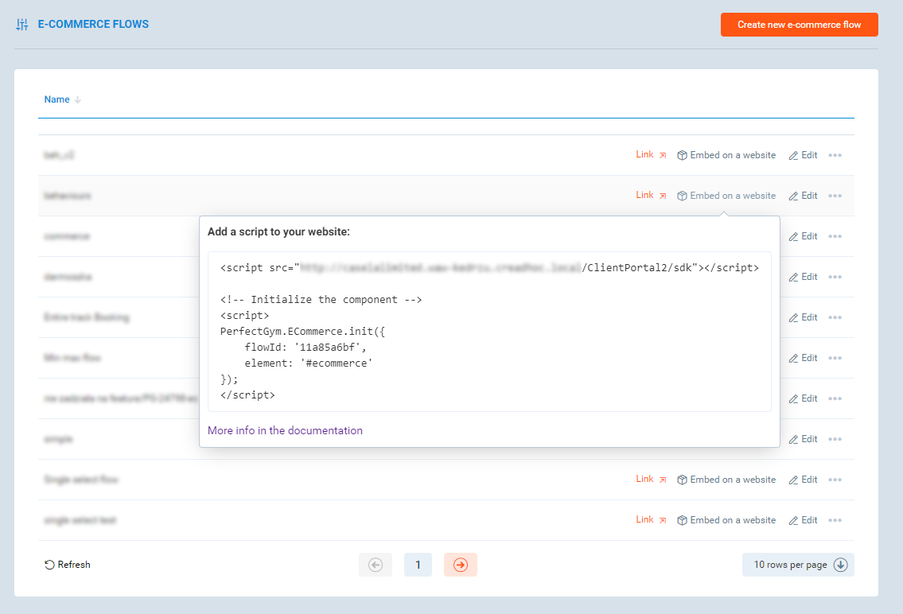

# E-commerce embedding guide

You can embedd E-commerce module to be a part of your own site.

## DEMO

[Basic](https://perfectgym.github.io/ClientPortal.ECommerce/)

[Redirecting from payment gate back to your page after payment](https://perfectgym.github.io/ClientPortal.ECommerce/returnUrl)

[Narrowing flow config to single club](https://perfectgym.github.io/ClientPortal.ECommerce/singleClub)

[Basic demo without usage of external libraries, that shows only code required for embeding)](https://perfectgym.github.io/ClientPortal.ECommerce/plain)

## Find ecommerce flow you want to embed

Go the the list of configured flows and find a script for embedding the flow:



It should look like this:

```html
<script src="https://yourcompany-perfectgym-address/ClientPortal2/sdk"></script>

<!-- Initialize the component -->
<script>
    PerfectGym.ECommerce.init({
        flowId: '9e7eadc518',
        element: '#ecommerce'
    });
</script>
```

## Add a script to your webpage

Include an SDK:

```html
<script src="https://yourcompany-perfectgym-address/ClientPortal2/sdk"></script>
```

Put this script somewhere at the end of your website `<body>` tag.

> Enter the script URL as is, do not download it and do not host it on your server!
> This script may change when releasing new version of ClientPortal.

You can specify a language for the ecommerce flow.
To do so, add `lang` query parameter with language of your choice (short ISO language code), for example:

```html
<script src="https://yourcompany-perfectgym-address/ClientPortal2/sdk?lang=pl"></script>
```

It works only for languages, that are enabled for your company.
If you are not sure, what are available languages, go into PGM and try to change the language:


If no language is specified, ClientPortal will try to load scripts for the language of the browser,
or fall back to default language.

## Initialize the ecommerce

Run the initialization script. It has several parameters:

-   `flowId` (required) - id of the e-commerce flow, this is always a string
-   `element` (required) - html element or element CSS selector to render the ecommerce to
-   `clubId` (optional) - if you have multiple clubs, you can force to choose a specific one
-   `returnUrl` (optional) - URL that you want to redirect to after the transaction is complete successfully or failed

For example:

```javascript
PerfectGym.ECommerce.init({
    flowId: '9e7eadc518',
    element: '#ecommerce',
    clubId: 1,
    returnUrl: 'https://my-club-site.com/thank-you-page.html'
});
```

## Usage in SPA applications

If you have a SPA application, and you don't reload the page when navigating, you will need to remember to destroy the ecommerce instance when is not needed anymore.

`PerfectGym.ECommerce.init` returns a promise, which resolves with initailized instance of ecommerce flow. To destroy it invoke `destroy()` method.

For example, for AngularJS application it would look something like this:

```js
window.PerfectGym.ECommerce.init({
    flowId: 'ed65ff14c',
    element: '#main'
}).then(ecommerce => {
    $scope.$on('$destroy', () => ecommerce.destroy());
});
```

## Add your domain to allowed domains

Embedding e-commerce uses CORS.
We have adapted proper security measures to make it safe, so we have to add your domain to the list of allowed ones.

To do that, please contact our support team.

The setting responsible for that is `ClientPortal.AllowedDomains`.

## Remarks

-   Do not try to change styles of e-commerce. Class names are not deterministic and may change, so you can break your application.
    We are constantly developing the application and make big changes at regular basis, so we cannot provide you a way to use your own CSS without risk of breaking the design.

-   Because we want to achieve best user experience and performance, we decided to not use IFRAMEs or anything like that, but to render the component directly on client site.
    This is best for resposiveness, animations and overall experience.

> This approach may cause that, you can by accident override our styles, which may result in breaking the appereance of the application once in a while.
> We make our best to secure our styles against such interferences, but it's possible that we miss something.
>
> In case you would see some UI errors, please contact our support, we will fix it ASAP.

-   Render the component at full width for smaller screens (i.e. mobile).
    Otherwise it may seriously hurt user experience and also does not look good.
    Our application is designed to work very well for mobile devices, so please keep it at 100% width.

-   Do not use `overflow: hidden` in any element above the e-commerce.
    This will hurt user experience, as it makes impossible to properly use `position: sticky`.
    We cannot do anything to work around this, so please comply.
